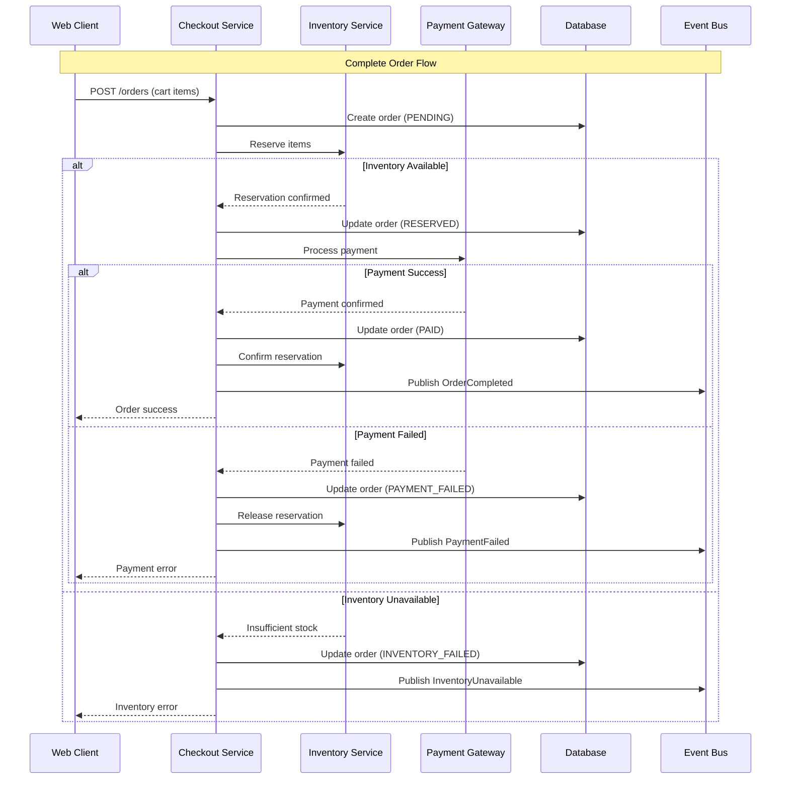
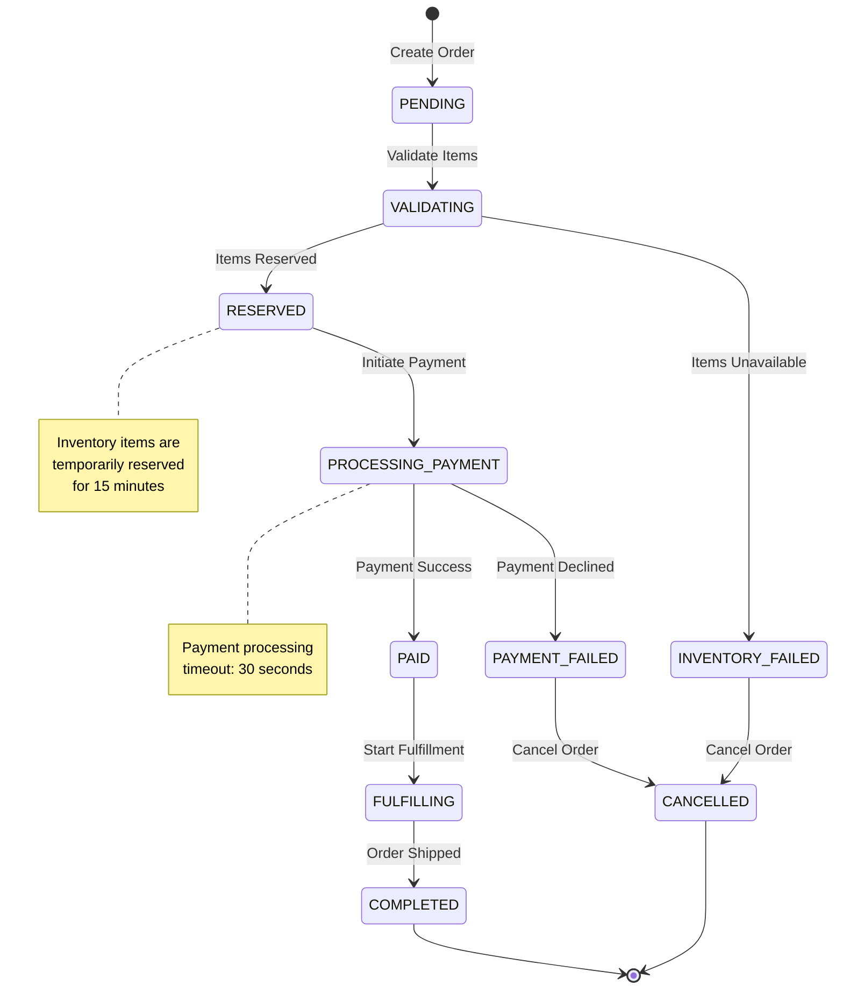

# BookVerse Checkout Service - Payment Flows Guide

**Order Processing, Payment Gateway Integration, and State Management**

This guide provides comprehensive documentation of the payment flows, order processing logic, and state management patterns implemented in the BookVerse Checkout Service.

---

## 🏗️ Payment Flow Architecture

The Checkout Service implements a robust, event-driven payment processing system that ensures data consistency, handles failures gracefully, and provides comprehensive audit trails.



---

## 📋 Order State Management

### Order State Machine

The order processing follows a well-defined state machine that ensures consistency and provides clear visibility into order progress.



### State Definitions

#### **Core States**
```python
class OrderState(str, Enum):
    """Order state enumeration with detailed definitions."""
    
    PENDING = "pending"              # Order created, awaiting validation
    VALIDATING = "validating"        # Checking item availability and pricing
    RESERVED = "reserved"            # Inventory reserved, payment pending
    PROCESSING_PAYMENT = "processing_payment"  # Payment gateway processing
    PAID = "paid"                    # Payment confirmed, fulfillment pending
    FULFILLING = "fulfilling"        # Order being prepared for shipment
    COMPLETED = "completed"          # Order successfully completed
    PAYMENT_FAILED = "payment_failed"  # Payment was declined or failed
    INVENTORY_FAILED = "inventory_failed"  # Insufficient inventory
    CANCELLED = "cancelled"          # Order cancelled or failed
    REFUNDED = "refunded"           # Order refunded after completion
```

#### **State Transition Rules**
```python
class OrderStateMachine:
    """
    Manages order state transitions with validation and audit logging.
    
    Ensures only valid state transitions occur and maintains comprehensive
    audit trail for compliance and debugging purposes.
    """
    
    VALID_TRANSITIONS = {
        OrderState.PENDING: [OrderState.VALIDATING, OrderState.CANCELLED],
        OrderState.VALIDATING: [
            OrderState.RESERVED,
            OrderState.INVENTORY_FAILED,
            OrderState.CANCELLED
        ],
        OrderState.RESERVED: [
            OrderState.PROCESSING_PAYMENT,
            OrderState.CANCELLED
        ],
        OrderState.PROCESSING_PAYMENT: [
            OrderState.PAID,
            OrderState.PAYMENT_FAILED
        ],
        OrderState.PAID: [OrderState.FULFILLING, OrderState.REFUNDED],
        OrderState.FULFILLING: [OrderState.COMPLETED, OrderState.CANCELLED],
        OrderState.PAYMENT_FAILED: [OrderState.CANCELLED],
        OrderState.INVENTORY_FAILED: [OrderState.CANCELLED],
        OrderState.COMPLETED: [OrderState.REFUNDED],
        OrderState.CANCELLED: [],  # Terminal state
        OrderState.REFUNDED: []    # Terminal state
    }
    
    def can_transition(self, from_state: OrderState, to_state: OrderState) -> bool:
        """Check if state transition is valid."""
        return to_state in self.VALID_TRANSITIONS.get(from_state, [])
    
    async def transition_order(self, order: Order, new_state: OrderState, 
                             reason: str = None, metadata: Dict = None) -> Order:
        """
        Execute order state transition with validation and audit logging.
        
        Args:
            order: Order instance to transition
            new_state: Target state for transition
            reason: Human-readable reason for transition
            metadata: Additional context data for audit trail
            
        Returns:
            Updated order instance
            
        Raises:
            InvalidTransitionError: If transition is not allowed
            OrderNotFoundError: If order doesn't exist
        """
        if not self.can_transition(order.state, new_state):
            raise InvalidTransitionError(
                f"Cannot transition from {order.state} to {new_state}"
            )
        
        # Create audit log entry
        audit_entry = OrderAuditLog(
            order_id=order.id,
            previous_state=order.state,
            new_state=new_state,
            reason=reason or f"System transition to {new_state}",
            metadata=metadata or {},
            timestamp=datetime.utcnow(),
            user_id=current_user.id if current_user else None
        )
        
        # Update order state
        old_state = order.state
        order.state = new_state
        order.updated_at = datetime.utcnow()
        
        # Save changes and audit log atomically
        async with database.transaction():
            await order.save()
            await audit_entry.save()
            
            # Trigger state change events
            await self.publish_state_change_event(order, old_state, new_state)
        
        logger.info(
            f"Order {order.id} transitioned from {old_state} to {new_state}",
            extra={
                "order_id": order.id,
                "old_state": old_state,
                "new_state": new_state,
                "reason": reason
            }
        )
        
        return order
```

---

## 💳 Payment Gateway Integration

### Payment Provider Abstraction

The Checkout Service uses a provider abstraction pattern to support multiple payment gateways while maintaining consistent interfaces.

```python
class PaymentProvider(ABC):
    """
    Abstract base class for payment provider implementations.
    
    Defines the contract that all payment providers must implement,
    enabling easy switching between providers and multi-provider support.
    """
    
    @abstractmethod
    async def create_payment_intent(self, payment_request: PaymentRequest) -> PaymentIntent:
        """
        Create a payment intent for the given amount and currency.
        
        Args:
            payment_request: Payment details including amount, currency, metadata
            
        Returns:
            PaymentIntent with provider-specific details and client secret
        """
        pass
    
    @abstractmethod
    async def confirm_payment(self, payment_intent_id: str, 
                            payment_method: PaymentMethod) -> PaymentResult:
        """
        Confirm payment using the provided payment method.
        
        Args:
            payment_intent_id: Provider-specific payment intent identifier
            payment_method: Customer payment method details
            
        Returns:
            PaymentResult with success status and transaction details
        """
        pass
    
    @abstractmethod
    async def refund_payment(self, transaction_id: str, 
                           amount: Optional[Decimal] = None) -> RefundResult:
        """
        Refund a completed payment transaction.
        
        Args:
            transaction_id: Original transaction identifier
            amount: Partial refund amount (None for full refund)
            
        Returns:
            RefundResult with refund status and details
        """
        pass
    
    @abstractmethod
    async def get_payment_status(self, payment_intent_id: str) -> PaymentStatus:
        """
        Get current status of a payment intent or transaction.
        
        Args:
            payment_intent_id: Provider-specific payment identifier
            
        Returns:
            PaymentStatus with current state and details
        """
        pass
```

### Stripe Payment Provider

```python
class StripePaymentProvider(PaymentProvider):
    """
    Stripe payment provider implementation with comprehensive error handling,
    webhooks integration, and idempotency support.
    """
    
    def __init__(self, api_key: str, webhook_secret: str):
        self.api_key = api_key
        self.webhook_secret = webhook_secret
        stripe.api_key = api_key
    
    async def create_payment_intent(self, payment_request: PaymentRequest) -> PaymentIntent:
        """Create Stripe payment intent with comprehensive metadata."""
        
        try:
            # Convert amount to cents (Stripe requirement)
            amount_cents = int(payment_request.amount * 100)
            
            stripe_intent = await stripe.PaymentIntent.create_async(
                amount=amount_cents,
                currency=payment_request.currency.lower(),
                metadata={
                    'order_id': payment_request.order_id,
                    'customer_id': payment_request.customer_id,
                    'source': 'bookverse_checkout'
                },
                description=f"BookVerse Order {payment_request.order_id}",
                automatic_payment_methods={'enabled': True},
                # Idempotency key for duplicate request protection
                idempotency_key=f"order_{payment_request.order_id}_{int(time.time())}"
            )
            
            return PaymentIntent(
                provider_intent_id=stripe_intent.id,
                client_secret=stripe_intent.client_secret,
                amount=payment_request.amount,
                currency=payment_request.currency,
                status=self._map_stripe_status(stripe_intent.status),
                metadata=stripe_intent.metadata
            )
            
        except stripe.error.StripeError as e:
            logger.error(f"Stripe payment intent creation failed: {e}")
            raise PaymentProviderError(f"Payment setup failed: {e.user_message}")
    
    async def confirm_payment(self, payment_intent_id: str, 
                            payment_method: PaymentMethod) -> PaymentResult:
        """Confirm Stripe payment with proper error handling."""
        
        try:
            stripe_intent = await stripe.PaymentIntent.confirm_async(
                payment_intent_id,
                payment_method=payment_method.provider_method_id,
                return_url=payment_method.return_url
            )
            
            result = PaymentResult(
                transaction_id=stripe_intent.id,
                status=self._map_stripe_status(stripe_intent.status),
                amount=Decimal(stripe_intent.amount) / 100,
                currency=stripe_intent.currency.upper(),
                provider_response=stripe_intent.to_dict()
            )
            
            # Handle special cases
            if stripe_intent.status == 'requires_action':
                result.requires_action = True
                result.next_action = stripe_intent.next_action
            
            return result
            
        except stripe.error.CardError as e:
            # Card was declined
            return PaymentResult(
                transaction_id=payment_intent_id,
                status=PaymentStatus.DECLINED,
                error_code=e.code,
                error_message=e.user_message,
                provider_response=e.json_body
            )
        
        except stripe.error.StripeError as e:
            logger.error(f"Stripe payment confirmation failed: {e}")
            raise PaymentProviderError(f"Payment processing failed: {e.user_message}")
    
    def _map_stripe_status(self, stripe_status: str) -> PaymentStatus:
        """Map Stripe status codes to internal payment status enum."""
        
        status_mapping = {
            'requires_payment_method': PaymentStatus.REQUIRES_PAYMENT_METHOD,
            'requires_confirmation': PaymentStatus.REQUIRES_CONFIRMATION,
            'requires_action': PaymentStatus.REQUIRES_ACTION,
            'processing': PaymentStatus.PROCESSING,
            'succeeded': PaymentStatus.SUCCEEDED,
            'canceled': PaymentStatus.CANCELLED
        }
        
        return status_mapping.get(stripe_status, PaymentStatus.UNKNOWN)
```

### Mock Payment Provider (Development)

```python
class MockPaymentProvider(PaymentProvider):
    """
    Mock payment provider for development and testing environments.
    
    Simulates payment gateway behavior including success, failure, and
    delay scenarios based on configurable test patterns.
    """
    
    def __init__(self, config: MockPaymentConfig):
        self.config = config
        self.payments = {}  # In-memory payment storage
    
    async def create_payment_intent(self, payment_request: PaymentRequest) -> PaymentIntent:
        """Create mock payment intent with configurable behavior."""
        
        intent_id = f"mock_pi_{uuid4().hex[:16]}"
        client_secret = f"mock_secret_{uuid4().hex[:16]}"
        
        # Simulate failure based on amount patterns
        if self._should_fail_creation(payment_request.amount):
            raise PaymentProviderError("Mock payment setup failure")
        
        # Store payment intent
        self.payments[intent_id] = {
            'id': intent_id,
            'amount': payment_request.amount,
            'currency': payment_request.currency,
            'status': 'requires_confirmation',
            'order_id': payment_request.order_id,
            'created_at': datetime.utcnow()
        }
        
        # Simulate network delay
        if self.config.simulate_delays:
            await asyncio.sleep(random.uniform(0.1, 0.5))
        
        return PaymentIntent(
            provider_intent_id=intent_id,
            client_secret=client_secret,
            amount=payment_request.amount,
            currency=payment_request.currency,
            status=PaymentStatus.REQUIRES_CONFIRMATION
        )
    
    async def confirm_payment(self, payment_intent_id: str, 
                            payment_method: PaymentMethod) -> PaymentResult:
        """Confirm mock payment with configurable success/failure patterns."""
        
        if payment_intent_id not in self.payments:
            raise PaymentProviderError("Payment intent not found")
        
        payment = self.payments[payment_intent_id]
        
        # Simulate processing delay
        if self.config.simulate_delays:
            await asyncio.sleep(random.uniform(0.5, 2.0))
        
        # Determine outcome based on test patterns
        outcome = self._determine_payment_outcome(payment, payment_method)
        
        if outcome == 'success':
            payment['status'] = 'succeeded'
            payment['transaction_id'] = f"mock_txn_{uuid4().hex[:16]}"
            
            return PaymentResult(
                transaction_id=payment['transaction_id'],
                status=PaymentStatus.SUCCEEDED,
                amount=payment['amount'],
                currency=payment['currency']
            )
        
        elif outcome == 'card_declined':
            payment['status'] = 'declined'
            
            return PaymentResult(
                transaction_id=payment_intent_id,
                status=PaymentStatus.DECLINED,
                error_code='card_declined',
                error_message='Your card was declined.'
            )
        
        else:  # processing_error
            raise PaymentProviderError("Mock processing error")
    
    def _should_fail_creation(self, amount: Decimal) -> bool:
        """Determine if payment creation should fail based on amount."""
        
        # Fail for amounts ending in .13 (e.g., $10.13)
        return str(amount).endswith('.13')
    
    def _determine_payment_outcome(self, payment: Dict, 
                                 payment_method: PaymentMethod) -> str:
        """Determine payment outcome based on test patterns."""
        
        amount = payment['amount']
        
        # Success for normal amounts
        if amount < Decimal('100.00'):
            return 'success'
        
        # Card declined for amounts ending in .99
        if str(amount).endswith('.99'):
            return 'card_declined'
        
        # Processing error for amounts ending in .00
        if str(amount).endswith('.00') and amount > Decimal('100.00'):
            return 'processing_error'
        
        return 'success'
```

---

## 🔄 Inventory Integration

### Reservation Management

The Checkout Service implements a sophisticated inventory reservation system that ensures consistency between order processing and inventory availability.

```python
class InventoryReservationManager:
    """
    Manages inventory reservations with timeout handling and conflict resolution.
    
    Ensures that inventory is properly reserved during order processing and
    released if orders are not completed within the timeout window.
    """
    
    def __init__(self, inventory_client: InventoryClient, 
                 reservation_timeout: int = 900):  # 15 minutes
        self.inventory_client = inventory_client
        self.reservation_timeout = reservation_timeout
        self.active_reservations = {}
    
    async def reserve_items(self, order: Order) -> ReservationResult:
        """
        Reserve inventory items for an order with comprehensive error handling.
        
        Args:
            order: Order containing items to reserve
            
        Returns:
            ReservationResult with success status and reservation details
            
        Raises:
            InsufficientInventoryError: If any items are not available
            InventoryServiceError: If inventory service is unreachable
        """
        
        reservation_id = f"order_{order.id}_{int(time.time())}"
        
        try:
            # Prepare reservation request
            reservation_items = [
                InventoryReservationItem(
                    book_id=item.book_id,
                    quantity=item.quantity,
                    price=item.unit_price
                )
                for item in order.items
            ]
            
            # Call inventory service
            reservation_response = await self.inventory_client.reserve_items(
                reservation_id=reservation_id,
                items=reservation_items,
                timeout_seconds=self.reservation_timeout
            )
            
            if reservation_response.success:
                # Store reservation details
                self.active_reservations[reservation_id] = {
                    'order_id': order.id,
                    'items': reservation_items,
                    'expires_at': datetime.utcnow() + timedelta(seconds=self.reservation_timeout),
                    'status': 'active'
                }
                
                # Schedule automatic release
                asyncio.create_task(
                    self._schedule_reservation_release(reservation_id)
                )
                
                return ReservationResult(
                    success=True,
                    reservation_id=reservation_id,
                    reserved_items=reservation_response.reserved_items,
                    expires_at=self.active_reservations[reservation_id]['expires_at']
                )
            
            else:
                # Handle partial or complete reservation failure
                return ReservationResult(
                    success=False,
                    error_code='insufficient_inventory',
                    error_message='One or more items are not available',
                    unavailable_items=reservation_response.unavailable_items
                )
        
        except aiohttp.ClientError as e:
            logger.error(f"Inventory service communication error: {e}")
            raise InventoryServiceError("Unable to check inventory availability")
        
        except Exception as e:
            logger.exception(f"Unexpected error during inventory reservation: {e}")
            raise InventoryServiceError("Inventory reservation failed")
    
    async def confirm_reservation(self, reservation_id: str) -> bool:
        """
        Confirm a reservation, converting it to permanent inventory allocation.
        
        Args:
            reservation_id: Unique reservation identifier
            
        Returns:
            True if confirmation successful, False otherwise
        """
        
        if reservation_id not in self.active_reservations:
            logger.warning(f"Attempt to confirm unknown reservation: {reservation_id}")
            return False
        
        try:
            confirmation_response = await self.inventory_client.confirm_reservation(
                reservation_id=reservation_id
            )
            
            if confirmation_response.success:
                # Mark reservation as confirmed
                self.active_reservations[reservation_id]['status'] = 'confirmed'
                
                logger.info(f"Reservation {reservation_id} confirmed successfully")
                return True
            
            else:
                logger.error(
                    f"Reservation confirmation failed: {confirmation_response.error_message}"
                )
                return False
        
        except Exception as e:
            logger.exception(f"Error confirming reservation {reservation_id}: {e}")
            return False
    
    async def release_reservation(self, reservation_id: str, 
                                reason: str = "Manual release") -> bool:
        """
        Release a reservation, making inventory available again.
        
        Args:
            reservation_id: Unique reservation identifier
            reason: Human-readable reason for release
            
        Returns:
            True if release successful, False otherwise
        """
        
        if reservation_id not in self.active_reservations:
            logger.warning(f"Attempt to release unknown reservation: {reservation_id}")
            return False
        
        try:
            release_response = await self.inventory_client.release_reservation(
                reservation_id=reservation_id
            )
            
            if release_response.success:
                # Remove from active reservations
                reservation = self.active_reservations.pop(reservation_id)
                
                logger.info(
                    f"Reservation {reservation_id} released: {reason}",
                    extra={
                        'reservation_id': reservation_id,
                        'order_id': reservation.get('order_id'),
                        'reason': reason
                    }
                )
                return True
            
            else:
                logger.error(
                    f"Reservation release failed: {release_response.error_message}"
                )
                return False
        
        except Exception as e:
            logger.exception(f"Error releasing reservation {reservation_id}: {e}")
            return False
    
    async def _schedule_reservation_release(self, reservation_id: str):
        """Automatically release reservation after timeout."""
        
        reservation = self.active_reservations.get(reservation_id)
        if not reservation:
            return
        
        # Wait until expiration time
        expires_at = reservation['expires_at']
        sleep_time = (expires_at - datetime.utcnow()).total_seconds()
        
        if sleep_time > 0:
            await asyncio.sleep(sleep_time)
        
        # Check if reservation still needs to be released
        if (reservation_id in self.active_reservations and 
            self.active_reservations[reservation_id]['status'] == 'active'):
            
            await self.release_reservation(
                reservation_id, 
                reason="Automatic timeout release"
            )
```

---

## 🎯 Order Processing Pipeline

### Complete Order Flow Implementation

```python
class OrderProcessor:
    """
    Orchestrates the complete order processing pipeline from cart to completion.
    
    Implements sophisticated error handling, state management, and event publishing
    to ensure reliable order processing with comprehensive audit trails.
    """
    
    def __init__(self, inventory_manager: InventoryReservationManager,
                 payment_service: PaymentService,
                 event_publisher: EventPublisher,
                 state_machine: OrderStateMachine):
        self.inventory_manager = inventory_manager
        self.payment_service = payment_service
        self.event_publisher = event_publisher
        self.state_machine = state_machine
    
    async def process_order(self, order_request: OrderRequest) -> OrderResult:
        """
        Process a complete order from cart items to payment confirmation.
        
        Implements the full order pipeline with proper error handling,
        state transitions, and event publishing at each stage.
        
        Args:
            order_request: Complete order request with items and payment details
            
        Returns:
            OrderResult with success status and order details
            
        Raises:
            OrderProcessingError: If order processing fails at any stage
        """
        
        order = None
        reservation_id = None
        
        try:
            # Step 1: Create initial order
            order = await self._create_initial_order(order_request)
            
            # Step 2: Validate items and pricing
            await self.state_machine.transition_order(
                order, OrderState.VALIDATING, "Starting order validation"
            )
            
            validation_result = await self._validate_order_items(order)
            if not validation_result.valid:
                await self.state_machine.transition_order(
                    order, OrderState.INVENTORY_FAILED, validation_result.error_message
                )
                return OrderResult(
                    success=False,
                    order=order,
                    error_code='validation_failed',
                    error_message=validation_result.error_message
                )
            
            # Step 3: Reserve inventory
            reservation_result = await self.inventory_manager.reserve_items(order)
            if not reservation_result.success:
                await self.state_machine.transition_order(
                    order, OrderState.INVENTORY_FAILED, "Insufficient inventory"
                )
                
                await self.event_publisher.publish(InventoryUnavailableEvent(
                    order_id=order.id,
                    unavailable_items=reservation_result.unavailable_items
                ))
                
                return OrderResult(
                    success=False,
                    order=order,
                    error_code='insufficient_inventory',
                    error_message='One or more items are not available',
                    unavailable_items=reservation_result.unavailable_items
                )
            
            reservation_id = reservation_result.reservation_id
            
            # Step 4: Update order with reservation details
            await self.state_machine.transition_order(
                order, OrderState.RESERVED, 
                f"Inventory reserved: {reservation_id}",
                metadata={'reservation_id': reservation_id}
            )
            
            # Step 5: Process payment
            await self.state_machine.transition_order(
                order, OrderState.PROCESSING_PAYMENT, "Initiating payment"
            )
            
            payment_result = await self.payment_service.process_payment(
                order_id=order.id,
                amount=order.total_amount,
                currency=order.currency,
                payment_method=order_request.payment_method
            )
            
            if payment_result.success:
                # Payment successful
                await self.state_machine.transition_order(
                    order, OrderState.PAID, 
                    f"Payment confirmed: {payment_result.transaction_id}",
                    metadata={
                        'transaction_id': payment_result.transaction_id,
                        'payment_method': order_request.payment_method.type
                    }
                )
                
                # Confirm inventory reservation
                await self.inventory_manager.confirm_reservation(reservation_id)
                
                # Publish success events
                await self.event_publisher.publish(OrderCompletedEvent(
                    order_id=order.id,
                    customer_id=order.customer_id,
                    total_amount=order.total_amount,
                    items=[
                        OrderItemEvent(
                            book_id=item.book_id,
                            quantity=item.quantity,
                            unit_price=item.unit_price
                        )
                        for item in order.items
                    ]
                ))
                
                return OrderResult(
                    success=True,
                    order=order,
                    payment_result=payment_result,
                    reservation_id=reservation_id
                )
            
            else:
                # Payment failed
                await self.state_machine.transition_order(
                    order, OrderState.PAYMENT_FAILED,
                    f"Payment failed: {payment_result.error_message}",
                    metadata={
                        'error_code': payment_result.error_code,
                        'payment_method': order_request.payment_method.type
                    }
                )
                
                # Release inventory reservation
                await self.inventory_manager.release_reservation(
                    reservation_id, "Payment failed"
                )
                
                await self.event_publisher.publish(PaymentFailedEvent(
                    order_id=order.id,
                    customer_id=order.customer_id,
                    error_code=payment_result.error_code,
                    error_message=payment_result.error_message
                ))
                
                return OrderResult(
                    success=False,
                    order=order,
                    error_code=payment_result.error_code,
                    error_message=payment_result.error_message,
                    payment_result=payment_result
                )
        
        except Exception as e:
            logger.exception(f"Unexpected error processing order: {e}")
            
            # Clean up on unexpected failure
            if order:
                await self.state_machine.transition_order(
                    order, OrderState.CANCELLED, f"System error: {str(e)}"
                )
            
            if reservation_id:
                await self.inventory_manager.release_reservation(
                    reservation_id, f"System error during processing: {str(e)}"
                )
            
            raise OrderProcessingError(f"Order processing failed: {str(e)}")
    
    async def _create_initial_order(self, order_request: OrderRequest) -> Order:
        """Create initial order record with PENDING state."""
        
        # Calculate totals
        subtotal = sum(item.quantity * item.unit_price for item in order_request.items)
        tax_amount = subtotal * order_request.tax_rate if order_request.tax_rate else Decimal('0')
        total_amount = subtotal + tax_amount + (order_request.shipping_cost or Decimal('0'))
        
        order = Order(
            id=str(uuid4()),
            customer_id=order_request.customer_id,
            state=OrderState.PENDING,
            currency=order_request.currency or 'USD',
            subtotal=subtotal,
            tax_amount=tax_amount,
            shipping_cost=order_request.shipping_cost or Decimal('0'),
            total_amount=total_amount,
            items=[
                OrderItem(
                    book_id=item.book_id,
                    quantity=item.quantity,
                    unit_price=item.unit_price,
                    line_total=item.quantity * item.unit_price
                )
                for item in order_request.items
            ],
            shipping_address=order_request.shipping_address,
            billing_address=order_request.billing_address,
            created_at=datetime.utcnow(),
            updated_at=datetime.utcnow()
        )
        
        await order.save()
        
        logger.info(f"Created order {order.id} for customer {order.customer_id}")
        
        return order
    
    async def _validate_order_items(self, order: Order) -> ValidationResult:
        """Validate order items against current inventory and pricing."""
        
        # This would typically involve checking current prices,
        # validating item availability, and ensuring business rules
        
        # For now, implement basic validation
        if not order.items:
            return ValidationResult(
                valid=False,
                error_message="Order must contain at least one item"
            )
        
        if order.total_amount <= 0:
            return ValidationResult(
                valid=False,
                error_message="Order total must be greater than zero"
            )
        
        return ValidationResult(valid=True)
```

---

## 🔗 Related Documentation

- **[Integration Guide](INTEGRATION_GUIDE.md)**: Service dependencies and API consumption patterns
- **[Testing Guide](TESTING.md)**: Mock payment setup and integration testing
- **[API Reference](../api/README.md)**: Complete API documentation and examples
- **[Development Guide](DEVELOPMENT_GUIDE.md)**: Local development and testing setup

---

**Authors**: BookVerse Platform Team  
**Version**: 1.0.0  
**Last Updated**: 2024-01-01
